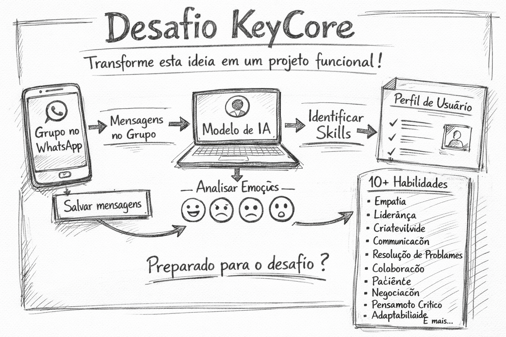

<p align="center">
  <picture>
    <source media="(prefers-color-scheme: dark)" srcset="assets/logo-keycore-dark.png">
    <source media="(prefers-color-scheme: light)" srcset="assets/logo-keycore-light.png">
    
  </picture>
</p>

<p align="center">
  
</p>

# 🚀 KeyCore Tech Challenge  
## Conversas → Emoções → Skills → Inteligência

Bem-vindo ao desafio técnico da KeyCore.

Queremos ver como você transforma uma ideia em um sistema real.

---

# 🎯 O Desafio

Construa uma aplicação que:

1. Crie ou conecte-se a um grupo no WhatsApp  
2. Capture todas as mensagens enviadas nesse grupo  
3. Armazene as mensagens em um banco de dados estruturado  
4. Analise cada mensagem utilizando IA  
5. Identifique emoções predominantes  
6. Detecte intenções comportamentais  
7. Gere automaticamente um perfil comportamental por usuário  
8. Atribua pelo menos 10 skills inferidas para cada participante  

O sistema deve atualizar os perfis dinamicamente conforme novas mensagens chegam.

---

# 🧠 O Problema Real

Conversas contêm sinais comportamentais.

Padrões emocionais + intenção + recorrência formam traços comportamentais.

O objetivo é transformar fluxo de conversa em inteligência estruturada.

---

# 🏗 Requisitos Funcionais

## 1. Captura de Mensagens

- Conectar a um grupo no WhatsApp  
- Receber mensagens em tempo real ou quase real  
- Identificar autor  
- Identificar timestamp  
- Armazenar conteúdo bruto  

---

## 2. Persistência

Banco de dados deve armazenar:

- Mensagens  
- Usuários  
- Emoções detectadas  
- Intenções  
- Embeddings, se aplicável  
- Histórico de skills por usuário  

Sugestões:

- PostgreSQL  
- Supabase  
- MongoDB  
- Redis  
- ElasticSearch  
- Banco vetorial opcional  

---

## 3. Análise de Emoção

Cada mensagem deve ser classificada com:

- Emoção primária  
- Score de confiança  

Exemplos:

- Alegria  
- Frustração  
- Ansiedade  
- Entusiasmo  
- Neutralidade  
- Raiva  
- Confiança  

Pode usar:

- Modelos HuggingFace  
- GoEmotions  
- BERT fine-tuned  
- GPT com saída estruturada  
- Claude  
- Gemini  
- Zero-shot classification  

---

## 4. Extração de Intenção

Detectar padrões como:

- Liderança  
- Colaboração  
- Conflito  
- Suporte  
- Questionamento  
- Organização  
- Análise crítica  
- Negociação  

---

## 5. Geração de Skills

Cada usuário deve possuir:

- Pelo menos 10 habilidades inferidas  
- Score por skill  
- Justificativa baseada em padrões  

Exemplo:

```json
{
  "user": "João",
  "skills": [
    { "name": "Comunicação Assertiva", "score": 0.87 },
    { "name": "Liderança Emergente", "score": 0.73 },
    { "name": "Pensamento Crítico", "score": 0.91 }
  ]
}
```

---

## ⚙️ Stack Livre

Você pode usar qualquer tecnologia.

### Integração WhatsApp
- Evolution API
- WPPConnect
- Baileys
- Meta Cloud API
- Twilio

### Orquestração
- n8n
- LangChain
- LangGraph
- Flowise
- Dify
- Autogen
- CrewAI

### Backend
- Node
- NestJS
- FastAPI
- Django
- Go

### Banco
- PostgreSQL
- MongoDB
- Supabase
- Qdrant
- Weaviate
- Pinecone

### Infra
- Docker
- Railway
- Fly
- Vercel
- AWS

---

## 🔥 Diferenciais que Valem Muito
- Uso de MCP
- Arquitetura orientada a eventos
- Pipeline assíncrono
- Embeddings para inferência comportamental
- Versionamento de modelo
- Logs estruturados
- Sistema escalável
- Observabilidade
- Dashboard analítico
- Prompt engineering estruturado
- Estrutura de scoring bem definida

---

## 📦 Como Participar
1. **Dê uma estrela (star ⭐)** neste repositório do GitHub.
2. **Faça um fork** deste repositório para sua conta.
3. Crie uma branch para o seu desenvolvimento (ex: `git checkout -b feat/solucao-seunome`).
4. Desenvolva sua solução.
5. Publique em algum ambiente acessível.
   - Deploy público é um diferencial.
6. Atualize o seu README com:
   - Arquitetura
   - Decisões técnicas
   - Como rodar
   - Como testar
   - Prints ou vídeo
7. Faça o commit e o push das suas alterações para o seu fork.
8. **Envie um Pull Request (PR)** para a nossa branch informando o link da sua aplicação publicada.

---

## ⚡ Velocidade Conta

Entregas rápidas são um diferencial.

Mas qualidade, clareza arquitetural e boas decisões técnicas pesam mais do que pressa.

Preferimos uma solução sólida entregue cedo do que algo grande e confuso.

---

## 📊 Critérios de Avaliação
1. Funciona ponta a ponta
2. Clareza arquitetural
3. Qualidade de código
4. Estrutura de dados
5. Inteligência na modelagem de skills
6. Uso eficiente de IA
7. Escalabilidade
8. Criatividade técnica
9. Documentação
10. Capacidade de evoluir para produto real

---

<p align="center">
  <a href="https://keycore.com.br" target="_blank">
    <picture>
      <source media="(prefers-color-scheme: dark)" srcset="assets/logo-keycore-dark.png">
      <source media="(prefers-color-scheme: light)" srcset="assets/logo-keycore-light.png">
      
    </picture>
  </a>
</p>